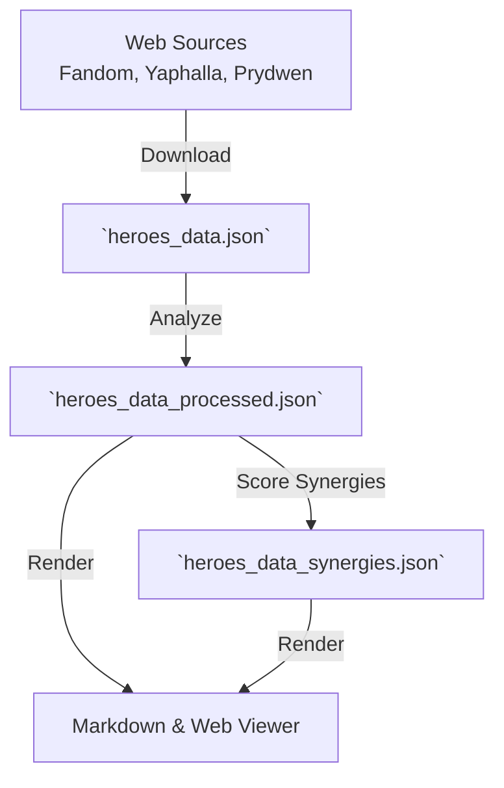

# The Skill Analysis Pipeline

This document explains how raw hero data from the web is transformed into the structured synergy and replacement recommendations you see in the AFK Journey reference. 

## High-Level Overview

The pipeline is an automated system that reads hero skills just like a player would, breaks them down into mechanical components (like "Stun", "Heal", or "Magic Damage"), and uses those components to calculate how heroes interact.

Instead of manually typing out every synergy for every hero, the system relies on a multi-stage pipeline to guarantee that recommendations are consistent, mathematically sound, and easy to update when the game changes.



---

## Deep Dive: The Pipeline Stages

### Stage 1: Data Collection (Download)
The pipeline begins by scraping the latest character data from community sources. 
- **Skill Text & Stats**: Sourced primarily from the [Fandom Wiki](https://afk-journey.fandom.com/wiki/Hero/List) and [Yaphalla](https://www.yaphalla.com/heroes).
- **Meta Tiers**: Sourced from the [Prydwen Tier List](https://www.prydwen.gg/afk-journey/tier-list) to ensure replacements are meta-viable.

All of this raw text is merged and saved into a single source of truth: [`data/heroes_data.json`](../data/heroes_data.json).

### Stage 2: Skill Processing (Analyze — pass 1)
The core engine lives in [`scripts/rewrite-summaries.py`](../scripts/rewrite-summaries.py). [`scripts/process_heroes.py`](../scripts/process_heroes.py) reconstructs hero markdown from `heroes_data.json`, runs per-hero analysis, and writes structured output.

It scans for:
- **Damage Types**: Physical, Magic, True Damage, HP-loss.
- **Crowd Control (CC)**: Stuns, knock-ups, charms, etc.
- **Buffs & Debuffs**: ATK SPD increases, DEF reductions, shields.
- **Targeting**: Does this hit a single enemy, an arc, or the whole battlefield?

**Example of Text Parsing:**
```json
// Raw text from the game
"Deals 200% damage to all enemies and knocks them into the air."

// How the pipeline understands it
{
  "damage_type": "Physical",
  "targeting": "All units",
  "cc": "Knock up"
}
```

This processed data is saved to [`data/heroes_data_processed.json`](../data/heroes_data_processed.json). Curated inputs (`signature_skills.json`, `hero_behavior_tags.json`, placement/movement/melee overrides) are read during this step but not overwritten.

### Stage 3: Synergy & Replacement Scoring (Analyze — pass 2)
[`scripts/process_synergies.py`](../scripts/process_synergies.py) evaluates every possible pair of heroes using matchers from [`scripts/generate-heroes-overview.py`](../scripts/generate-heroes-overview.py) (shared scoring library, not a separate render step).

It looks at what a hero **provides** (e.g., Haste buffs, Magic damage) and matches it against what another hero **requires** (e.g., a slow Ultimate that needs Haste, or a passive that triggers on allied Magic damage). The results are saved to [`data/heroes_data_synergies.json`](../data/heroes_data_synergies.json).

### Stage 4: Rendering (Views)
[`scripts/render_overview.py`](../scripts/render_overview.py) and [`scripts/render_site.py`](../scripts/render_site.py) read the committed JSON and produce `heroes-overview.md`, `heroes-overview.csv`, and `site/data/heroes.json`. [`scripts/render_heroes.py`](../scripts/render_heroes.py) regenerates `Heroes.md` from `heroes_data.json`. Rendering does not re-run skill-text detection — run `just analyze` first when processed data changes.

See also [synergy algorithm](synergy-algorithm.md), [replacement algorithm](replacement-algorithm.md), and [AI-generated data](ai-generated-data.md) for curated metadata used during analyze/render.

---

## The Challenges of Skill Analysis

Because the pipeline relies on reading the English descriptions of skills, it faces significant challenges. The game's text is written for humans, not computers, which means the analysis scripts require constant adjustment and validation.

### Inconsistent Terminology
Game developers frequently use different words to describe the exact same mechanic. The pipeline has to be taught to recognize all these variations and map them to a single, standardized term.

For example, to detect a **Bind** (immobilize) effect, the script has to look for:
- "unable to move"
- "immobilize"
- "bind"
- "freezing them"
- "freeze enemies"

If a new hero is released and their skill says "roots the enemy to the ground," the pipeline will miss the CC entirely until a developer adds "roots" to the detection rules.

### Implicit Mechanics and Flavor Text
Sometimes, a skill's mechanical effect is hidden behind "flavor text" or implicit phrasing. 
- "Hypnotizing all enemies" must be mapped to **Sleep**.
- "Knocking them into the air" must be mapped to **Knock up**.

Furthermore, flavor text can cause false positives. If a skill says, "The hero summons a magical shield that deals physical damage," the script might accidentally detect a defensive Shield buff when it's actually just an attack animation.

### Complex Targeting and Ranges
Determining *who* a skill hits is notoriously difficult. A phrase like "enemies within range" or "the area with the most enemies" requires complex logic to translate into a standardized targeting weight (like "Area" or "Multiple targets"). If the targeting is parsed incorrectly, a hero might be scored as a massive team-wide buffer when they actually only buff one adjacent ally.

### The Need for Constant Adjustment
Because of these natural language processing challenges, the pipeline is never truly "finished." Every time the game updates, or a new hero is released, the following can happen:
1. **New Mechanics**: A hero introduces a brand new mechanic (like "HP-loss" or "Stellar Bond") that the script has never seen before.
2. **Broken Patterns**: A new skill description uses a sentence structure that breaks the existing regular expressions (regex).
3. **Spurious Data**: A skill is misclassified (e.g., an execute threshold is accidentally parsed as physical damage).

To combat this, the project relies on `just validate`, validation snapshots under `docs/validation-*.md`, and manual or AI-generated overrides (`signature_skills.json`, behavior tags, movement/melee overrides) to catch and correct the script when the raw text is too ambiguous to parse perfectly.