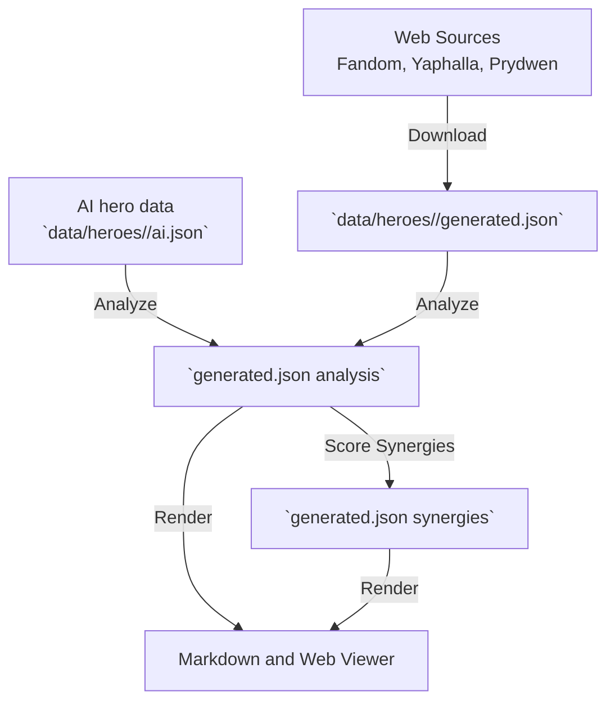

# The Skill Analysis Pipeline

This document explains how raw hero data from the web is transformed into the structured synergy and replacement recommendations you see in the AFK Journey reference.

## High-Level Overview

The pipeline reads hero skills, breaks them down into mechanical components (like "Stun", "Heal", or "Magic Damage"), and uses those components to calculate how heroes interact.

Instead of manually typing out every synergy for every hero, the system relies on a multi-stage pipeline to guarantee that recommendations are consistent, mathematically sound, and easy to update when the game changes.



---

## Deep Dive: The Pipeline Stages

### Stage 1: Data Collection (Download)
The pipeline begins by scraping the latest character data from community sources.
- **Skill Text & Stats**: Sourced primarily from the [Fandom Wiki](https://afk-journey.fandom.com/wiki/Hero/List) and [Yaphalla](https://www.yaphalla.com/heroes).
- **Meta Tiers**: Sourced from the [Prydwen Tier List](https://www.prydwen.gg/afk-journey/tier-list) to ensure replacements are meta-viable.

The ordered [`data/roster.json`](../data/roster.json) manifest identifies each
hero. Raw text is saved in that hero's `generated.json`; it is not assembled
into a canonical roster file.

### Stage 2: Skill Processing (Analyze — pass 1)

Skill **effects** (buffs, debuffs, CC, damage types, healing, shields, energy,
immunities, special provides/requires) are authored in each hero's `ai.json`.
Use the
[extract-skill-effects](../.cursor/skills/extract-skill-effects/SKILL.md)
skill when adding a hero or when skill text changes.

[`scripts/hero_pipeline_cli.py`](../scripts/hero_pipeline_cli.py) runs offline
per-hero analysis and roster calibration. The analysis implementation is
organized behind `scripts/hero_pipeline/analysis/`; its legacy effect engine
still provides the semantic implementation while the migration is staged:

1. **Load sidecar** — `scripts/skill_effects_store.py` reads the hero's JSON;
   missing or stale sidecars fail `just validate`.
2. **Apply effects** — `apply_sidecar_to_hero()` builds per-skill `skill_slices`
   with effects, summon effects, immunities, and special effects.
3. **Post-process** — script-side regex still runs on top of sidecar data:
   upgrade numerics, magnitudes, benefit stats, movement, placement constraints,
   proximity auras, and skill-card tag formatting.

**Example:**

```json
// Raw text from the game
"Deals 200% damage to all enemies and knocks them into the air."

// Sidecar tier entry (authored via extract-skill-effects)
{
  "effects": [
    { "type": "damage", "label": "Physical", "target": "all_units" },
    { "type": "cc", "label": "Knock up", "target": "all_units" }
  ]
}
```

This processed data is saved in each hero's `generated.json`. Curated inputs
and typed corrections are read from that hero's `ai.json` and `overrides.json`.

### Stage 3: Synergy & Replacement Scoring (Analyze — pass 2)
[`scripts/process_synergies.py`](../scripts/process_synergies.py) evaluates every possible pair of heroes using matchers from [`scripts/generate-heroes-overview.py`](../scripts/generate-heroes-overview.py) (shared scoring library, not a separate render step).

It looks at what a hero **provides** (e.g., Haste buffs, Magic damage) and
matches it against what another hero **requires** (e.g., a slow Ultimate that
needs Haste, or a passive that triggers on allied Magic damage). The results
are saved in each hero's `generated.json` using stable IDs.

### Stage 4: Rendering (Views)
[`scripts/render_overview.py`](../scripts/render_overview.py) and
[`scripts/render_site.py`](../scripts/render_site.py) consume the structured
projection and produce `heroes-overview.md`, `heroes-overview.csv`, and
`site/data/heroes.json`. [`scripts/render_heroes.py`](../scripts/render_heroes.py)
regenerates `Heroes.md` from the manifest and hero-local source. Rendering does
not re-run skill-text detection — run `just analyze` first when generated data
is stale.

See also [synergy algorithm](synergy-algorithm.md), [replacement algorithm](replacement-algorithm.md), and [AI-generated data](ai-generated-data.md) for curated metadata used during analyze/render.

---

## The Challenges of Skill Analysis

Because skill descriptions are written for humans, not computers, extraction and validation require ongoing attention.

### Inconsistent Terminology
Game developers frequently use different words to describe the exact same mechanic. The AI extraction workflow must recognize variations and map them to standardized schema labels.

For example, to detect a **Bind** (immobilize) effect, the sidecar author must recognize:
- "unable to move"
- "immobilize"
- "bind"
- "freezing them"
- "freeze enemies"

If a new hero says "roots the enemy to the ground," the sidecar must map that to **Bind** — there is no regex rule table to patch.

### Implicit Mechanics and Flavor Text
Sometimes, a skill's mechanical effect is hidden behind flavor text.
- "Hypnotizing all enemies" must be mapped to **Sleep**.
- "Knocking them into the air" must be mapped to **Knock up**.

Flavor text can also cause false positives if an author misreads an attack animation as a defensive Shield buff.

### Complex Targeting and Ranges
Determining *who* a skill hits is notoriously difficult. A phrase like "enemies within range" or "the area with the most enemies" must be translated into standardized targeting (like "Area" or "Multiple targets"). Wrong targeting in the sidecar can score a hero as a team-wide buffer when they only buff one adjacent ally.

### Validation and Safety Nets
Because natural language is ambiguous, the pipeline is never truly "finished." Every game update or new hero can introduce:
1. **New mechanics** — brand new labels (like "HP-loss" or "Stellar Bond").
2. **Stale sidecars** — skill text changed but `source_hash` was not refreshed.
3. **Spurious data** — an execute threshold misclassified as physical damage.

To combat this, the project relies on:
- `just validate` — schema checks, sidecar staleness, and coarse semantic CC-gap
  hints in `scripts/validate_processed.py`
- Validation snapshots under `docs/validation-*.md`
- Manual or AI-generated overrides in each hero's `ai.json` and
  `overrides.json`
- The [hero-data](../.cursor/skills/hero-data/SKILL.md) audit workflow

Fix missing or wrong effects by editing
`data/heroes/<hero-id>/ai.json` via
[extract-skill-effects](../.cursor/skills/extract-skill-effects/SKILL.md), then
run `just views`.
